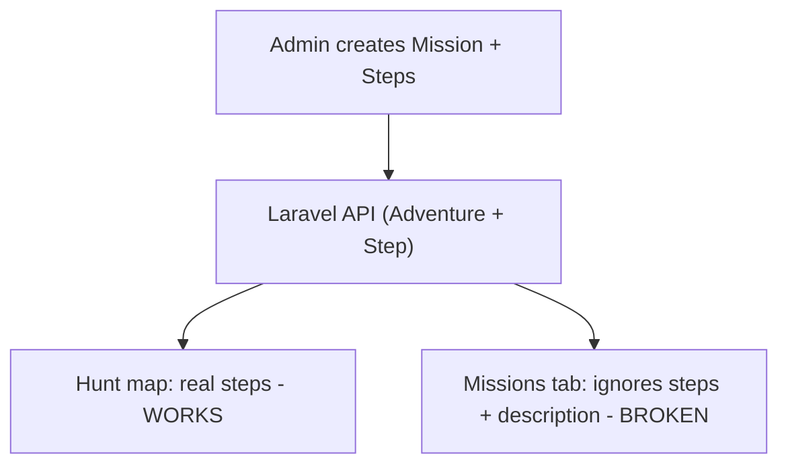

# Team Changes: Frontend Execution Plan

## Source of truth

`[../TEAM_CHANGES_FRONTEND.md](../TEAM_CHANGES_FRONTEND.md)` is the authoritative handoff doc. This plan mirrors it.

- Backend `C:\Users\Stone\Herd\marketplace-engine` is **do-not-touch** and verified live. **Every item below ships without a backend change.**
- `#8` is decided: **Option A — Claim enrolls** via the existing `POST /adventures/{id}/start`.
- `#3` is **deferred** pending a product decision (AI vs plain template).

## Context: two separate mission UIs

- **Hunt map** (`[components/HuntMapView.tsx](components/HuntMapView.tsx)`) - the REAL game; real steps, proof upload, enrollment via `POST /adventures/{id}/start`. Leave unchanged.
- **Missions tab** (`[components/BrowseView.tsx](components/BrowseView.tsx)` -> `[components/MissionDetailView.tsx](components/MissionDetailView.tsx)`) - a LEGACY screen: Claim is a no-op, descriptions/steps are hardcoded. This is the root of #10 and #8.

## Recommended order

1. **#10 + #8** - wire Missions tab to real Adventure data + Claim enrolls (one PR).
2. **#4** - character count on restaurant Description (trivial).
3. **#1** - buttons audit (boxed, audit only).
4. **#2** - design audit against the kid-view canon.
5. **#5 / #6 / #7** - static pages cluster.
6. **#3** - deferred until product confirms.

---

## #10 + #8 (first PR)

Backend `GET /adventures/{id}` already returns the steps array and the adventure `description` (confirmed in the doc against `AdventureController::show`). No backend change needed.

Files to touch:
- `[state.ts](state.ts)` - extend `Mission` with optional `description?: string` and `steps?: Array<{ id; sequence; type; title; description?; requirement_type; points }>`. Note: `Mission.status` is already typed `status: string` (loose), so adding `'started'` for #8 needs **no type change**.
- `[src/repositories/ApiMissionsRepository.ts](src/repositories/ApiMissionsRepository.ts)` - `transformAdventure` (lines 76-89) must stop dropping `description`/`steps`; pass them through. Replace the `claim()` no-op (lines 45-53) with a real `POST /adventures/{id}/start` (`{ snack_id: null }`).
- `[components/MissionDetailView.tsx](components/MissionDetailView.tsx)` - delete the hardcoded `missionDescriptions` map (lines 20-25) and the hardcoded instructions; render `mission.description` + `mission.steps`. On Claim success set status `'started'` and show a "Started - head to the map" toast.

Acceptance: open an active adventure as a kid -> Missions tab -> tap a mission -> real description + real step list (with proof-type labels). Claim POSTs once (idempotent via `firstOrCreate`), button disables to "Started". Hunt map unchanged.

## #4 - Character count

`[components/merchant/MerchantPortal.tsx](components/merchant/MerchantPortal.tsx)` `MerchantSettings`, Description `TextInput` at ~line 1534.
- Add `maxLength={500}`.
- Caption below input: `{(profileDraft.description ?? '').length} / 500` (the field binds to `profileDraft.description` and can be null - guard it), right-aligned, dim color; red cue at `>= 480`.

## #1 - Buttons audit (BOXED, audit only)

Do NOT fix. Output one checklist covering Hunt/Missions/Menu tabs in `BrowseView`, mission card -> detail (`setSelectedMission` in `[App.tsx](App.tsx)`), Back, Claim, Mark Complete, and the never-mounted `[components/LeaderboardView.tsx](components/LeaderboardView.tsx)`. For each: routed correctly? handler does anything? user feedback?

## #2 - Design inconsistencies audit

Canon is the **kid view** (`[components/HomeView.tsx](components/HomeView.tsx)`, `[components/HuntMapView.tsx](components/HuntMapView.tsx)`), not `tokens.ts`. Update `[components/admin/ui/tokens.ts](components/admin/ui/tokens.ts)` to the kid canon, then sweep each screen into a `DESIGN_AUDIT.md` checklist. Fixes are separate tickets.

## #5 / #6 / #7 - Static pages

- #6 Help/FAQ: `components/HelpFAQView.tsx`, hardcoded Q&A, link from `[components/AccountView.tsx](components/AccountView.tsx)` and `MerchantSupport`.
- #7 Privacy/Terms: `components/PrivacyPolicyView.tsx` + `components/TermsView.tsx`, placeholder copy until legal provides text; link from `AccountView`.
- #5 Directions: confirm kid-hunt vs driver-delivery before building.

## #3 - Generate description (DEFERRED)

Confirm with product: plain template (FE-only prefill button) vs AI (needs backend - ping Stone). Do not build yet.

---

## Out of scope

- AI endpoints (#3 pending product).
- Any backend / marketplace-engine changes.
- Refactoring `HuntMapView` onto a new `AdventureMapCanvas` (works as-is; opportunistic only).
